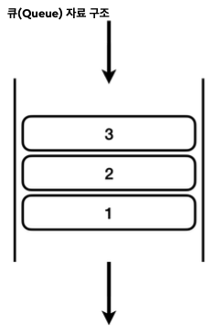

# 학습을 하는 이유

> 실무에 필요한 기본기를 확실하게 다지기 위해
> 객체지향에 대해 이해하기 위해
> 100번 보는것보다 직접 코드를 완성하고 실행시켜보자

- 코드 재사용성
- 모듈화
- 확장성과 유연성
- 추상화를 통한 복잡도 관리
- 유지 보수

# 목차

- [학습을 하는 이유](#학습을-하는-이유)
- [목차](#목차)
- [1. 클래스와 데이터](#1-클래스와-데이터)
  - [클래스가 필요한 이유](#클래스가-필요한-이유)
    - [Class1](#class1)
      - [문제점](#문제점)
    - [Class2](#class2)
      - [문제점](#문제점-1)
      - [정리](#정리)
  - [클래스 도입](#클래스-도입)
    - [Student 클래스](#student-클래스)
    - [ClassStar3](#classstar3)
      - [클래스와 사용자 정의 타입](#클래스와-사용자-정의-타입)
      - [용어: 클래스, 객체, 인스턴스](#용어-클래스-객체-인스턴스)
  - [객체 사용](#객체-사용)
    - [객체에 값 대입](#객체에-값-대입)
    - [객체 값 읽기](#객체-값-읽기)
  - [클래스, 객체, 인스턴스 정리](#클래스-객체-인스턴스-정리)
  - [배열 도입 - 리펙토링](#배열-도입---리펙토링)
    - [배열에 참조값을 대입한 이후 최종 그림](#배열에-참조값을-대입한-이후-최종-그림)
  - [정리](#정리-1)
- [2. 기본형과 참조형](#2-기본형과-참조형)
  - [기본형 vs 참조형1 - 시작](#기본형-vs-참조형1---시작)
  - [기본형 vs 참조형2 - 변수 대입](#기본형-vs-참조형2---변수-대입)
  - [메서드에 객체 전달](#메서드에-객체-전달)
    - [createStudent() 메서드 호출 분석](#createstudent-메서드-호출-분석)
  - [변수와 초기화](#변수와-초기화)
    - [변수의 종류](#변수의-종류)
  - [Null](#null)
    - [**GC - 아무도 참조하지 않는 인스턴스의 최후**](#gc---아무도-참조하지-않는-인스턴스의-최후)
  - [NullPointerException](#nullpointerexception)
- [3. 객체 지향 프로그래밍](#3-객체-지향-프로그래밍)
  - [절차 지향 프로그래밍1 - 시작](#절차-지향-프로그래밍1---시작)
  - [정리](#정리-2)
    - [객체 지향 프로그래밍 vs 절차 지향 프로그래밍](#객체-지향-프로그래밍-vs-절차-지향-프로그래밍)
    - [객체란?](#객체란)
- [4. 생성자](#4-생성자)
  - [생성자 - 필요한 이유](#생성자---필요한-이유)
  - [this](#this)
    - [this의 생략](#this의-생략)
  - [기본 생성자](#기본-생성자)
  - [생성자 - 오버로딩과 this](#생성자---오버로딩과-this)
- [5. 패키지 - 시작](#5-패키지---시작)
  - [패키지 규칙](#패키지-규칙)
    - [패키지 규칙](#패키지-규칙-1)
    - [패키지와 계층 구조](#패키지와-계층-구조)
  - [패키지 활용](#패키지-활용)
  - [패키지 규칙](#패키지-규칙-2)
    - [패키지 규칙](#패키지-규칙-3)
- [6. 접근 제어자](#6-접근-제어자)
  - [접근 제어자 종류](#접근-제어자-종류)
  - [접근 제어자 사용 - 클래스 레벨](#접근-제어자-사용---클래스-레벨)
  - [캡슐화](#캡슐화)
- [7. 자바 메모리 구조와 static](#7-자바-메모리-구조와-static)
  - [자바 메모리 구조](#자바-메모리-구조)
  - [스택과 큐 자료 구조](#스택과-큐-자료-구조)
    - [스택 구조](#스택-구조)
  - [static 변수](#static-변수)
    - [변수와 생명주기](#변수와-생명주기)
    - [정적 변수 접근 법](#정적-변수-접근-법)
  - [static 메서드](#static-메서드)

# 1. 클래스와 데이터

## 클래스가 필요한 이유

### Class1

```Java
package class1;

public class ClassStart1 {
    /** 문제: 학생 정보 출력 프로그램 만들기
     * 당신은 두 명의 학생 정보를 출력하는 프로그램을 작성해야 한다. 각 학생은 이름, 나이, 성적을 가지고 있다.

     * **요구 사항:**
     * 1. 첫 번째 학생의 이름은 "학생1", 나이는 15, 성적은 90입니다.
     * 2. 두 번째 학생의 이름은 "학생2", 나이는 16, 성적은 80입니다.
     * 3. 각 학생의 정보를 다음과 같은 형식으로 출력해야 합니다: `"이름: [이름] 나이: [나이] 성적: [성적]"`
     * 4. 변수를 사용해서 학생 정보를 저장하고 변수를 사용해서 학생 정보를 출력해야 합니다.

     * **예시 출력:**
     * 이름: 학생1 나이: 15 성적: 90
     * 이름: 학생2 나이: 16 성적: 80
     */
    public static void main(String[] args) {
        String student1Name = "학생1";
        int studnet1Age = 15;
        int student1Grade = 90;

        String student2Name = "학생2";
        int studnet2Age = 16;
        int student2Grade = 80;

        System.out.println("이름:" + student1Name + " 나이:" + studnet1Age + " 성적:" + student1Grade);
        System.out.println("이름:" + student2Name + " 나이:" + studnet2Age + " 성적:" + student2Grade);
    }
}

```

#### 문제점

이 코드의 문제는 학생이 늘어날 때 마다 변수를 추가로 선언해야 하고, 또 출력하는 코드도 추가해야 한다.

### Class2

```java
ackage class1;

public class ClassStart2 {
    /** ClassStart1 문제를 배열로 해결하보기
     * 배열을 사용한 덕분에 학생이 추가되어도 배열에 학생의 데이터만 추가하면 된다.
     * 이제 변수를 더 추가하지 않아도 되고, 출력 부분의 코드도 그대로 유지할 수 있다
     */
    public static void main(String[] args) {
        String[] studentNames = {"학생1", "학생2","학생3","학생4"};
        int[] studentAges = {15, 16, 17, 18};
        int[] studentGrades = {90, 80, 70, 60};

        for (int i = 0; i < studentNames.length; i++) {
            System.out.println("이름:" + studentNames[i] + " 나이:" + studentAges[i] + " 성적:" + studentGrades[i]);
        }
    }
}
```

#### 문제점

배열을 사용해서 코드 변경을 최소화하는데는 성공했지만,
한 학생의 데이터가 `studentNames[]` , `studentAges[]` , `studentGrades[]` 라는 3개의 배열에 나누어져 있다.
따라서 데이터를 변경할 때 매우 조심해서 작업해야 한다.
예를 들어서 학생 2의 데이터를 제거하려면 각각의 배열마다 학생2의 요소를 정확하게 찾아서 제거 해주어야 한다.

#### 정리

지금처럼 이름, 나이, 성적을 각각 따로 나누어서 관리하는 것은 사람이 관리하기 좋은 방식이 아니다.
사람이 관리하기 좋은 방식은 학생이라는 개념을 하나로 묶는 것이다. 그리고 각각의 학생 별로 본인의 이름, 나이, 성적 을 관리하는 것이다.

## 클래스 도입

### Student 클래스

```java
 package class1;
 public class Student {
     String name;
  int age;
  int grade;
  }
```

이렇게 **클래스에 정의한 변수들을 멤버 변수, 또는 필드**라 한다.

- **멤버 변수(Member Variable)**: 이 변수들은 특정 클래스에 소속된 멤버이기 때문에 이렇게 부른다.
- **필드(Field)**: 데이터 항목을 가리키는 전통적인 용어이다. 데이터베이스, 엑셀 등에서 데이터 각각의 항목을 필드 라 한다.
  자바에서 멤버 변수, 필드는 같은 뜻이다. 클래스에 소속된 변수를 뜻한다.

**클래스는 관례상 대문자로 시작하고 낙타 표기법을 사용한다.**
예): `Student` , `User` , `MemberService`

### ClassStar3

```java
package class1;

public class ClassStart3 {
    public static void main(String[] args) {
        Student student1;
        student1 = new Student();
        student1.name = "학생1";
        student1.age = 15;
        student1.grade = 90;

        // new Student(); = 실제 메모리에 만들어진 객체 또는 인스턴츠
        Student student2 = new Student();
        student2.name = "학생2";
        student2.age = 16;
        student2.grade = 80;

        System.out.println("이름:" + student1.name + " 나이:" + student1.age + " 성적:" + student1.grade);
        System.out.println("이름:" + student2.name + " 나이:" + student2.age + " 성적:" + student2.grade);
    }
}

```

#### 클래스와 사용자 정의 타입

- 타입은 데이터의 종류나 형태를 나타낸다.
- `int` 라고 하면 정수 타입, `String` 이라고 하면 문자 타입이다.
- 학생( `Student` )이라는 타입을 만들면 되지 않을까?
- 클래스를 사용하면 `int` , `String` 과 같은 타입을 직접 만들 수 있다.
- 사용자가 직접 정의하는 사용자 정의 타입을 만들려면 설계도가 필요하다. 이 **설계도가 바로 클래스**이다.
- 설계도인 클래스를 사용해서 **실제 메모리에 만들어진 실체를 객체 또는 인스턴스**라 한다.
- 클래스를 통해서 사용자가 원하는 종류의 데이터 타입을 마음껏 정의할 수 있다.

#### 용어: 클래스, 객체, 인스턴스

클래스는 설계도이고, 이 설계도를 기반으로 실제 메모리에 만들어진 실체를 객체 또는 인스턴스라 한다. 둘다 같은 의 미로 사용된다.
여기서는 학생( `Student` ) 클래스를 기반으로 학생1( `student1` ), 학생2( `student2` ) 객체 또는 인스턴스를 만들었 다.

```java
Student student1 = new Student(); //1. Student 객체 생성
Student student1 = x001; //2. new Student()의 결과로 x001 참조값 반환
student1 = x001; //3. 최종 결과
```

## 객체 사용

클래스를 통해 생성한 객체를 사용하려면 먼저 메모리에 존재하는 객체에 접근해야 한다. 객체에 접근하려면 `.` (점, dot)을 사용하면 된다.

```java
//객체 값 대입
student1.name = "학생1";
student1.age = 15;
student1.grade = 90;

//객체 값 사용
System.out.println("이름:" + student1.name + " 나이:" + student1.age + " 성적:" +
 student1.grade);
```

#### 객체에 값 대입

객체가 가지고 있는 멤버 변수( `name` , `age` , `grade` )에 값을 대입하려면 먼저 객체에 접근해야 한다.
객체에 접근하려면 `.` (점, dot) 키워드를 사용하면 된다. 이 키워드는 변수( `student1` )에 들어있는 참조값( `x001` )을 읽어서 메모리에 존재하는 객체에 접근한다.

```java
student1.name="학생1" //1. student1 객체의 name 멤버 변수에 값 대입
x001.name="학생1" //2.변수에 있는 참조값을 통해 실제 객체에 접근, 해당 객체의 name 멤버 변수에 값
대입
```

#### 객체 값 읽기

객체의 값을 읽는 것도 앞서 설명한 내용과 같다. `.` (점, dot) 키워드를 통해 참조값을 사용해서 객체에 접근한 다음에 원하는 작업을 하면 된다. 다음 예제를 보자.

```java
//1. 객체 값 읽기
System.out.println("이름:" + student1.name);
//2. 변수에 있는 참조값을 통해 실제 객체에 접근하고, name 멤버 변수에 접근한다.
System.out.println("이름:" + x001.name);
//3. 객체의 멤버 변수의 값을 읽어옴
System.out.println("이름:" + "학생1");
```

## 클래스, 객체, 인스턴스 정리

**클래스 - Class**
클래스는 객체를 생성하기 위한 '틀' 또는 '설계도'이다. 클래스는 객체가 가져야 할 속성(변수)과 기능(메서드)를 정의한다.

- 틀: 붕어빵 틀을 생각해보자. 붕어빵 틀은 붕어빵이 아니다! 이렇게 생긴 붕어빵이 나왔으면 좋겠다고 만드는 틀일 뿐이다. 실제 먹을 수 있는 것이 아니다. 실제 먹을 수 있는 팥 붕어빵을 객체 또는 인스턴스라 한다.
- 설계도: 자동차 설계도를 생각해보자. 자동차 설계도는 자동차가 아니다! 설계도는 실제 존재하는 것이 아니라 개
  념으로만 있는 것이다. 설계도를 통해 생산한 실제 존재하는 흰색 테슬라 모델 Y 자동차를 객체 또는 인스턴스라 한다.

**객체 - Object**
객체는 클래스에서 정의한 속성과 기능을 가진 실체이다. 객체는 서로 독립적인 상태를 가진다.
예를 들어 위 코드에서 `student1` 은 학생1의 속성을 가지는 객체이고, `student2` 는 학생2의 속성을 가지는 객체이 다. `student1` 과 `student2` 는 같은 클래스에서 만들어졌지만, 서로 다른 객체이다.

**인스턴스 - Instance**
인스턴스는 특정 클래스로부터 생성된 객체를 의미한다. 그래서 객체와 인스턴스라는 용어는 자주 혼용된다. 인스턴스 는 주로 객체가 어떤 클래스에 속해 있는지 강조할 때 사용한다. 예를 들어서 `student1` 객체는 `Student` 클래스의 인스턴스다. 라고 표현한다.

**객체 vs 인스턴스**
둘다 클래스에서 나온 실체라는 의미에서 비슷하게 사용되지만, 용어상 인스턴스는 객체보다 좀 더 관계에 초점을 맞춘 단어이다. 보통 `student1` 은 `Student` 의 객체이다. 라고 말하는 대신 `student1` 은 `Student` 의 인스턴스이다. 라고 특정 클래스와의 관계를 명확히 할 때 인스턴스라는 용어를 주로 사용한다.

좀 더 쉽게 풀어보자면, 모든 인스턴스는 객체이지만, 우리가 인스턴스라고 부르는 순간은 특정 클래스로부터 그 객체가 생성되었음을 강조하고 싶을 때이다. 예를 들어 `student1` 은 객체이지만, 이 객체가 `Student` 클래스로부터 생성되 다는 점을 명확히 하기 위해 `student1` 을 `Student` 의 인스턴스라고 부른다.

## 배열 도입 - 리펙토링

```
public class ClassStart4 {
    public static void main(String[] args) {
        Student student1; //`Student` 타입을 받을 수 있는 변수를 선언한다.
        student1 = new Student(); //x001 `new Student()` 는 `Student` 클래스 정보를 기반으로 새로운 객체를 생성하라는 뜻
        /** 2. 객체 생성
         *`Student` 클래스는 `String name` , `int age` , `int grade` 멤버 변수를 가지고 있다.
         * 이 변수를 사용하는 데 필요한 메모리 공간도 함께 확보
         * 객체를 생성하면 자바는 메모리 어딘가에 있는 이 객체에 접근할 수 있는 참조값(주소)( `x001` )을 반환
         */
        student1.name = "학생1"; //1. student1 객체의 name 멤버 변수에 값 대입
        student1.age = 15;
        student1.grade = 90;

        // new Student(); = 실제 메모리에 만들어진 객체 또는 인스턴츠
        Student student2 = new Student(); //x002
        student2.name = "학생2";
        student2.age = 16;
        student2.grade = 80;

        // ⭐ 자바에서 대입은 항상 변수에 들어 있는 값을 복사한다.
        Student[] students = new Student[2]; // Student` 변수를 2개 보관할 수 있는 사이즈 2의 배열을 만듬
        students[0] = student1; // student1의 참조값
        students[1] = student2; // student2의 참조값
        //이제 배열은 `x001` , `x002` 의 참조값을 가진다. 참조값을 가지고 있기 때문에 `x001` (학생1), `x002` (학생2) `Student` 인스턴스에 모두 접근할 수 있다.


        System.out.println("이름:" +  students[0].name + " 나이:" +  students[0].age + " 성적:" +  students[0].grade);
        System.out.println("이름:" + students[1].name + " 나이:" + students[1].age + " 성적:" + students[1].grade);


    }
}
```


- 이제 배열은 `x001` , `x002` 의 참조값을 가진다. 참조값을 가지고 있기 때문에 `x001` (학생1), `x002` (학생2) `Student` 인스턴스에 모두 접근할 수

### 배열에 참조값을 대입한 이후 최종 그림

](img/array2.png)

**자바에서 대입은 항상 변수에 들어 있는 값을 복사해서 전달한다.**

- 변수에는 인스턴스 자체가 들어있는 것이 아니다! 인스턴스의 위치를 가리키는 참조값이 들어있을 뿐이다! 따라서 대입 ( `=` )시에 인스턴스가 복사되는 것이 아니라 참조값만 복사된다.
-

## 정리

- **클래스에 정의한 변수들을 멤버 변수, 또는 필드**라 한다.

  - **멤버 변수(Member Variable)**: 이 변수들은 특정 클래스에 소속된 멤버이기 때문에 이렇게 부른다.
  - **필드(Field)**: 데이터 항목을 가리키는 전통적인 용어이다. 데이터베이스, 엑셀 등에서 데이터 각각의 항목을 필드 라 한다.
  - 자바에서 멤버 변수, 필드는 같은 뜻이다. 클래스에 소속된 변수를 뜻한다.

- **자바에서 대입은 항상 변수에 들어 있는 값을 복사해서 전달한다.**

- new 를 쓰면 새로운 메모리가 생성되는 것 이다.

# 2. 기본형과 참조형

## 기본형 vs 참조형1 - 시작

- 기본형(Primitive Type): int , long , double , boolean 처럼 변수에 사용할 값을 직접 넣을 수 있는 데이
  터 타입을 기본형이라 한다.
- 참조형(Reference Type): Student student1 , int[] students 와 같이 데이터에 접근하기 위한 참조
  (주소)를 저장하는 데이터 타입을 참조형이라 한다. 참조형은 객체 또는 배열에 사용된다

**기본형 vs 참조형 - 기본**

- 참조형은 실제 사용하는 값을 변수에 담는 것이 아니다. 이름 그대로 실제 객체의 위치(참조, 주소)를 저장한다. 참
  조형에는 객체와 배열이 있다

      - 객체는 . (dot)을 통해서 메모리 상에 생성된 객체를 찾아가야 사용할 수 있다.
      - 배열은 [] 를 통해서 메모리 상에 생성된 배열을 찾아가야 사용할 수 있다.

**기본형 vs 참조형 - 계산**

기본형은 연산이 가능하지만 참조형은 연산이 불가능하다.

```java
int a = 10, b = 20;
int sum = a + b;
```

기본형은 변수에 실제 사용하는 값이 담겨있다. 따라서 + , - 와 같은 연산이 가능하다.

```java
Student s1 = new Student();
Student s2 = new Student();
s1 + s2 //오류 발생
```

참조형은 변수에 객체의 위치인 참조값이 들어있다. 참조값은 계산에 사용할 수 없다. 따라서 오류가 발생한다.

**쉽게 이해하는 팁**

- 기본형을 제외한 나머지는 모두 참조형이다.
  - 기본형은 소문자로 시작한다. int , long , double , boolean 모두 소문자로 시작한다.
    - 기본형은 자바가 기본으로 제공하는 데이터 타입이다. 이러한 기본형은 개발자가 새로 정의할 수 없다. 개발자는 참조형인 클래스만 직접 정의할 수 있다.
- 클래스는 대문자로 시작한다. Student
  - 클래스는 모두 참조형이다.

**참고 - String**
String 은 사실은 클래스다. 따라서 참조형이다. 그런데 기본형처럼 문자 값을 바로
대입할 수 있다.

## 기본형 vs 참조형2 - 변수 대입

**대원칙: 자바는 항상 변수의 값을 복사해서 대입한다.**

**기본형 대입**

```java
int a = 10;
int b = a;
```

**참조형 대입**

```java
Student s1 = new Student();
Student s2 = s1;
```

기본형은 변수에 값을 대입하더라도 실제 사용하는 값이 변수에 바로 들어있기 때문에 해당 값만 복사해서 대입한다고
생각하면 쉽게 이해할 수 있다. 그런데 **참조형의 경우 실제 사용하는 객체가 아니라 객체의 위치를 가리키는 참조값만
복사**된다. 쉽게 이야기해서 실제 건물이 복사가 되는 것이 아니라 건물의 위치인 주소만 복사되는 것이다. 따라서 같은
건물을 찾아갈 수 있는 방법이 하나 늘어날 뿐이다.

**기본형과 참조형의 메서드 호출**
자바에서 메서드의 매개변수(파라미터)는 항상 값에 의해 전달된다. 그러나 이 값이 실제 값이냐, 참조(메모리 주소)값
이냐에 따라 동작이 달라진다.

- **기본형**: 메서드로 기본형 데이터를 전달하면, 해당 값이 복사되어 전달된다. 이 경우, 메서드 내부에서 매개변수
  (파라미터)의 값을 변경해도, 호출자의 변수 값에는 영향이 없다.
- **참조형:** 메서드로 참조형 데이터를 전달하면, 참조값이 복사되어 전달된다. 이 경우, 메서드 내부에서 매개변수(파
  라미터)로 전달된 객체의 멤버 변수를 변경하면, 호출자의 객체도 변경된다.

## 메서드에 객체 전달

```java
package ref;

public class Method1 {

    public static void main(String[] args) {
        Student student1 = new Student();
        initStudent(student1, "학생1", 15, 90);
//        student1.name = "학생1";
//        student1.grade = 15;
//        student1.age = 90;

        Student student2 = new Student();
        initStudent(student1, "학생2", 16, 80);

        printStudent(student1);
        printStudent(student2);

    }

    static void initStudent(Student student, String name, int age, int grade) {
        student.name = name;
        student.age = age;
        student.grade = grade;
    }

    static void printStudent(Student student1) {
        System.out.println("이름:" + student1.name + " 나이:" + student1.age + " 성적:" + student1.grade);
    }
}


```

참조형은 메서드를 호출할 때 참조값을 전달한다. 따라서 메서드 내부에서 전달된 참조값을 통해 객체의 값을 변경하거
나, 값을 읽어서 사용할 수 있다

- `initStudent(Student student, ...) `: 전달한 학생 객체의 필드에 값을 설정한다.
- `printStudent(Student student, ...) ` : 전달한 학생 객체의 필드 값을 읽어서 출력한다.
- ](img/method.png)

- 이 메서드를 호출하면서 student1 을 전달한다. 그러면 student1 의 참조값이 매개변수 student 에 전달된
  다. 이 참조값을 통해 initStudent() 메서드 안에서 student1 이 참조하는 것과 동일한 x001 Student
  인스턴스에 접근하고 값을 변경할 수 있다.

### createStudent() 메서드 호출 분석

```java
package ref;

public class Method2 {

    public static void main(String[] args) {
        // 1. createStudent 메서드 호출
        Student student1 = createStudent("학생1", 15, 90); //
        Student student2 =createStudent("학생2", 16, 80);

        printStudent(student1);
        printStudent(student2);
    }

    static Student createStudent(String name, int age, int grade) {
        // 2. 인스턴스 생성, 초기값 설정
        // 모든 객체를 만든후 참조값을 반환
        Student student = new Student();
        student.name = name;
        student.age = age;
        student.grade = grade;
        // 3. 메서드 반환
        return student;
    }

    static void printStudent(Student student1) {
        System.out.println("이름:" + student1.name + " 나이:" + student1.age + " 성적:" + student1.grade);
    }
}

```

**진행과정**

```java
Student student1 = createStudent("학생1", 15, 90) //메서드 호출후 결과 반환
Student student1 = student(x001) //참조형인 student를 반환
Student student1 = x001 //student의 참조값 대입
student1 = x001
```

## 변수와 초기화

#### 변수의 종류

- 멤버 변수(필드) : 클래스에 선언
- 지역 변수 : 메서드에 선언, 매개변수도 지역 변수의 한 종류이다.

**멤버 변수, 필드 예시**

```java
public class Student {
 String name;
 int age;
 int grade;
}
```

name , age , grade 는 멤버 변수이다.

**지역 변수 예시**

```java
public class ClassStart3 {
 public static void main(String[] args) {
 Student student1;
 student1 = new Student();
 Student student2 = new Student();
 }
}
```

```java
public class MethodChange1 {
 public static void main(String[] args) {
 int a = 10;
 System.out.println("메서드 호출 전: a = " + a);
 changePrimitive(a);
 System.out.println("메서드 호출 후: a = " + a);
 }
 public static void changePrimitive(int x) {
 x = 20;
 }
}
```

a , x (매개변수)는 지역 변수이다.
지역 변수는 이름 그대로 특정 지역에서만 사용되는 변수라는 뜻이다. 예를 들어서 변수 x 는 changePrimitive()
메서드의 블록에서만 사용된다. changePrimitive() 메서드가 끝나면 제거된다. a 변수도 마찬가지이다.
main() 메서드가 끝나면 제거된다.

## Null

**null 값 할당**

```java
package ref;
public class Data {
 int value;
}
```

```java
package ref;
public class NullMain1 {
 public static void main(String[] args) {
 Data data = null;
 System.out.println("1. data = " + data);
 data = new Data();
 System.out.println("2. data = " + data);
 data = null;
 System.out.println("3. data = " + data);
 }
}
```

**실행결과**

```
1. data = null
2. data = ref.Data@x001
3. data = null
```

### **GC - 아무도 참조하지 않는 인스턴스의 최후**

garbege collection
data 에 null 을 할당했다. 따라서 앞서 생성한 x001 Data 인스턴스를 더는 아무도 참조하지 않는다. 이렇게 아무
도 참조하지 않게 되면 x001 이라는 참조값을 다시 구할 방법이 없다. 따라서 해당 인스턴스에 다시 접근할 방법이 없
다.
**이렇게 아무도 참조하지 않는 인스턴스는 사용되지 않고 메모리 용량만 차지할 뿐이다**.

## NullPointerException

`NullPointerException` 은 이름 그대로 `null`을 가리키다(Pointer)인데, 이때 발생하는 예외(Exception)다.
null 은 없다는 뜻이므로 결국 주소가 없는 곳을 찾아갈 때 발생하는 예외이다

객체를 참조할 때는 `.` (dot)을 사용한다. 이렇게 하면 참조값을 사용해서 해당 객체를 찾아갈 수 있다. 그런데 참조값이
`null 이라면 값이 없다는 뜻이므로, 찾아갈 수 있는 객체(인스턴스)가 없다. `NullPointerException` 은 이처럼
null 에 . (dot)을 찍었을 때 발생한다.

# 3. 객체 지향 프로그래밍

## 절차 지향 프로그래밍1 - 시작

**절차 지향 프로그래밍 vs 객체 지향 프로그래밍**
프로그래밍 방식은 크게 절차 지향 프로그래밍과 객체 지향 프로그래밍으로 나눌 수 있다.

**절차 지향 프로그래밍**

- 절차 지향 프로그래밍은 이름 그대로 절차를 지향한다. 쉽게 이야기해서 실행 순서를 중요하게 생각하는 방식이 다.
- 절차 지향 프로그래밍은 프로그램의 흐름을 순차적으로 따르며 처리하는 방식이다. 즉, "어떻게"를 중심으로 프로 그래밍 한다.

**객체 지향 프로그래밍**

- 객체 지향 프로그래밍은 이름 그대로 객체를 지향한다. 쉽게 이야기해서 객체를 중요하게 생각하는 방식이다.
- 객체 지향 프로그래밍은 실제 세계의 사물이나 사건을 객체로 보고, 이러한 객체들 간의 상호작용을 중심으로 프 로그래밍하는 방식이다. 즉, "무엇을" 중심으로 프로그래밍 한다.

**둘의 중요한 차이**

- 절차 지향은 데이터와 해당 데이터에 대한 처리 방식이 분리되어 있다. 반면 객체 지향에서는 데이터와 그 데이터 에 대한 행동(메서드)이 하나의 '객체' 안에 함께 포함되어 있다.

우리는 지금까지 클래스와 객체를 사용해서 관련 데이터를 묶어서 사용하는 방법을 학습했다. 그럼 앞서 배운 것 처럼 단순히 객체를 사용하기만 하면 객체 지향 프로그래밍이라 할 수 있을까? 사실 **지금까지 우리가 작성한 모든 프로그램은 절차 지향 프로그램**이다.
그렇다면 무엇이 객체 지향 프로그래밍이란 말인가?

## 정리

### 객체 지향 프로그래밍 vs 절차 지향 프로그래밍

객체 지향 프로그래밍과 절차 지향 프로그래밍은 서로 대치되는 개념이 아니다. 객체 지향이라도 프로그램의 작동 순서 는 중요하다. 다만 어디에 더 초점을 맞추는가에 둘의 차이가 있다. 객체 지향의 경우 객체의 설계와 관계를 중시한다. 반면 절차 지향의 경우 데이터와 기능이 분리되어 있고, 프로그램이 어떻게 작동하는지 그 순서에 초점을 맞춘다.

**절차 지향 프로그래밍**

- 절차 지향 프로그래밍은 이름 그대로 절차를 지향한다. 쉽게 이야기해서 실행 순서를 중요하게 생각하는 방식이 다.
- 절차 지향 프로그래밍은 프로그램의 흐름을 순차적으로 따르며 처리하는 방식이다. 즉, "어떻게"를 중심으로 프로 그래밍 한다.

**객체 지향 프로그래밍**

- 객체 지향 프로그래밍은 이름 그대로 객체를 지향한다. 쉽게 이야기해서 객체를 중요하게 생각하는 방식이다.
- 객체 지향 프로그래밍은 실제 세계의 사물이나 사건을 객체로 보고, 이러한 객체들 간의 상호작용을 중심으로 프 로그래밍하는 방식이다. 즉, "무엇을" 중심으로 프로그래밍 한다.
  **둘의 중요한 차이**
- 절차 지향은 데이터와 해당 데이터에 대한 처리 방식이 분리되어 있다. 반면 객체 지향에서는 데이터와 그 데이터 에 대한 행동(메서드)이 하나의 '객체' 안에 함께 포함되어 있다.

### 객체란?

세상의 모든 사물을 단순하게 추상화해보면 속성(데이터)과 기능 딱 2가지로 설명할 수 있다.

**자동차**

- 속성: 차량 색상, 현재 속도
- 기능: 엑셀, 브레이크, 문 열기, 문 닫기

**동물**

- 속성: 색상, 키, 온도
- 기능: 먹는다. 걷는다.

**게임 케릭터**

- 속성: 레벨, 경험치, 소유한 아이템들
- 기능: 이동, 공격, 아이템 획득

객체 지향 프로그래밍은 모든 사물을 속성과 기능을 가진 객체로 생각하는 것이다. 객체에는 속성과 기능만 존재한다. 이렇게 단순화하면 세상에 있는 객체들을 컴퓨터 프로그램으로 쉽게 설계할 수 있다.
이런 장점들 덕분에 지금은 객체 지향 프로그래밍이 가장 많이 사용된다.
참고로 실세계와 객체가 항상 1:1로 매칭되는 것은 아니다.

# 4. 생성자

### 생성자 - 필요한 이유

객체를 생성하는 시점에 어떤 작업을 하고 싶다면 생성자(Constructor)를 이용하면 된다.
생성자를 알아보기 전에 먼저 생성자가 왜 필요한지 코드로 간단히 알아보자.

**MemberInit**

```java
 package construct;
 public class MemberInit {
     String name;
int age;
int grade; }
```

**MethodInitMain1**

```java
package construct;
 public class MethodInitMain1 {
     public static void main(String[] args) {
         MemberInit member1 = new MemberInit();
         member1.name = "user1";
         member1.age = 15;
         member1.grade = 90;
         MemberInit member2 = new MemberInit();
         member2.name = "user2";
          member2.age = 16;
         member2.grade = 80;
         MemberInit[] members = {member1, member2};
         for (MemberInit s : members) {
System.out.println("이름:" + s.name + " 나이:" + s.age + " 성적:" + }
} }
```

회원 객체를 생성하고 나면 `name` , `age` , `grade` 같은 변수에 초기값을 설정한다. 아마도 회원 객체를 제대로 사용하 기 위해서는 객체를 생성하자 마자 이런 초기값을 설정해야 할 것이다. 이 코드에는 회원의 초기값을 설정하는 부분이 계속 반복된다. 메서드를 사용해서 반복을 제거해보자.

```java
package construct;
 public class MethodInitMain2 {
     public static void main(String[] args) {
         MemberInit member1 = new MemberInit();
         initMember(member1, "user1", 15, 90);
         MemberInit member2 = new MemberInit();
         initMember(member2, "user2", 16, 80);
         MemberInit[] members = {member1, member2};
         for (MemberInit s : members) {
System.out.println("이름:" + s.name + " 나이:" + s.age + " 성적:" + }
     static void initMember(MemberInit member, String name, int age, int grade) {
         member.name = name;
           member.age = age;
         member.grade = grade;
     }
}
```

`initMember(...)` 메서드를 사용해서 반복을 제거했다. 그런데 이 메서드는 대부분 `MemberInit` 객체의 멤버 변 수를 사용한다. 우리는 앞서 객체 지향에 대해서 학습했다. 이런 경우 속성과 기능을 한 곳에 두는 것이 더 나은 방법이 다. 쉽게 이야기해서 `MemberInit` 이 자기 자신의 데이터를 변경하는 기능(메서드)을 제공하는 것이 좋다.

## this

```java
this.name = name; //1. 오른쪽의 name은 매개변수에 접근
this.name = "user"; //2. name 매개변수의 값 사용
x001.name = "user"; //3. this.은 인스턴스 자신의 참조값을 뜻함, 따라서 인스턴스의 멤버 변수에 접
근
```

정리\*\*

- 매개변수의 이름과 맴버 변수의 이름이 같은 경우 `this` 를 사용해서 둘을 명확하게 구분해야 한다.
- `this` 는 인스턴스 자신을 가리킨다.

### this의 생략

`this` 는 생략할 수 있다. 이 경우 변수를 찾을 때 가까운 지역변수(매개변수도 지역변수다)를 먼저 찾고 없으면 그 다음
으로 멤버 변수를 찾는다. 멤버 변수도 없으면 오류가 발생한다.

```java
 package construct;
 public class MemberThis {
     String nameField;
     void initMember(String nameParameter) {
         nameField = nameParameter;
} }

```

- `nameField` 는 먼저 지역변수(매개변수)에서 같은 이름이 있는지 찾는다. 이 경우 없으므로 맴버 변수에서 찾는
  다.
- `nameParameter` 는 먼저 지역변수(매개변수)에서 같은 이름이 있는지 찾는다. 이 경우 매개변수가 있으므로 매
  개변수를 사용한다.

## 기본 생성자

생각해보면 생성자를 만들지 않았는데, 생성자를 호출한 적이 있다.

**기본 생성자**

- 매개변수가 없는 생성자를 기본 생성자라 한다.
- 클래스에 생성자가 하나도 없으면 자바 컴파일러는 매개변수가 없고, 작동하는 코드가 없는 기본 생성자를 자동으 로 만들어준다.
- **생성자가 하나라도 있으면 자바는 기본 생성자를 만들지 않는다.**

**기본 생성자를 왜 자동으로 만들어줄까?**
만약 자바에서 기본 생성자를 만들어주지 않는다면 생성자 기능이 필요하지 않은 경우에도 모든 클래스에 개발자가 직 접 기본 생성자를 정의해야 한다. 생성자 기능을 사용하지 않는 경우도 많기 때문에 이런 편의 기능을 제공한다.

**정리**

- 생성자는 반드시 호출되어야 한다.
- 생성자가 없으면 기본 생성자가 제공된다.
- **생성자가 하나라도 있으면 기본 생성자가 제공되지 않는다.** 이 경우 개발자가 정의한 생성자를 직접 호출해야 한 다.

## 생성자 - 오버로딩과 this

생성자도 메서드 오버로딩처럼 매개변수만 다르게 해서 여러 생성자를 제공할 수 있다.

**MemberConstruct - 생성자 추가**

```java
package construct;
 public class MemberConstruct {
     String name;
     int age;
     int grade;
//추가
MemberConstruct(String name, int age) {
         this.name = name;
         this.age = age;
         this.grade = 50;
}
MemberConstruct(String name, int age, int grade) {
System.out.println("생성자 호출 name=" + name + ",age=" + age + ",grade=" +
 grade);
         this.name = name;
         this.age = age;
         this.grade = grade;
     }
}
```

기존 `MemberConstruct` 에 생성자를 하나 추가해서 생성자가 2개가 되었다.

```java
 MemberConstruct(String name, int age)
 MemberConstruct(String name, int age, int grade)
```

새로 추가한 생성자는 `grade` 를 받지 않는다. 대신에 `grade` 는 `50` 점이 된다.

```java
 package construct;
public class ConstructMain2 {
    public static void main(String[] args) {
        MemberConstruct member1 = new MemberConstruct("user1", 15, 90);
        MemberConstruct member2 = new MemberConstruct("user2", 16);
        MemberConstruct[] members = {member1, member2};
        for (MemberConstruct s : members) {
System.out.println("이름:" + s.name + " 나이:" + s.age + " 성적:" + }
} }
```

**실행 결과**

```java
생성자 호출 name=user1,age=15,grade=90
이름:user1 나이:15 성적:90
이름:user2 나이:16 성적:50
```

생성자를 오버로딩 한 덕분에 성적 입력이 꼭 필요한 경우에는 `grade` 가 있는 생성자를 호출하면 되고, 그렇지 않은 경 우에는 `grade` 가 없는 생성자를 호출하면 된다. `grade` 가 없는 생성자를 호출하면 성적은 `50` 점이 된다.

**this() 규칙**

- `this()` 는 생성자 코드의 첫줄에만 작성할 수 있다.

다음은 규칙 위반이다. 이 경우 컴파일 오류가 발생한다.

```java
public MemberConstruct(String name, int age) {
     System.out.println("go");
     this(name, age, 50);
}
```

`this()` 가 생성자 코드의 첫줄에 사용되지 않았다.

# 5. 패키지 - 시작

**큰 프로그램**

```
User
UserManager
UserHistory
Product
 ProductCatalog
 ProductImage
Order
 OrderService
 OrderHistory
 ShoppingCart
CartItem
Payment
 PaymentHistory
Shipment
 ShipmentTracker
```

매우 많은 클래스가 등장하면서 관련 있는 기능들을 분류해서 관리하고 싶을 것이다.

컴퓨터는 보통 파일을 분류하기 위해 폴더, 디렉토리라는 개념을 제공한다. 자바도 이런 개념을 제공하는데, 이것이 바 로 패키지이다.
다음과 같이 카테고리를 만들고 분류해보자.

```
* user
* User
   * UserManager
   * UserHistory
 * product
   * Product
   * ProductCatalog
   * ProductImage
 * order
   * Order
   * OrderService
   * OrderHistory
 * cart
   * ShoppingCart
   * CartItem
 * payment
* Payment
   * PaymentHistory
 * shipping
   * Shipment
   * ShipmentTracker
```

여기서 `user` , `product` 등이 바로 패키지이다. 그리고 해당 패키지 안에 관련된 자바 클래스들을 넣으면 된다. 패키지(package)는 이름 그대로 물건을 운송하기 위한 포장 용기나 그 포장 묶음을 뜻한다.

## 패키지 규칙

### 패키지 규칙

- 패키지의 이름과 위치는 폴더(디렉토리) 위치와 같아야 한다. (필수)
- 패키지 이름은 모두 소문자를 사용한다. (관례)
- 패키지 이름의 앞 부분에는 일반적으로 회사의 도메인 이름을 거꾸로 사용한다. 예를 들어,
  `com.company.myapp` 과 같이 사용한다. (관례) - 이 부분은 필수는 아니다. 하지만 수 많은 외부 라이브러리가 함께 사용되면 같은 패키지에 같은 클래스 이 름이 존재할 수도 있다. 이렇게 도메인 이름을 거꾸로 사용하면 이런 문제를 방지할 수 있다. - 내가 오픈소스나 라이브러리를 만들어서 외부에 제공한다면 꼭 지키는 것이 좋다. - 내가 만든 애플리케이션을 다른 곳에 공유하지 않고, 직접 배포한다면 보통 문제가 되지 않는다.

### 패키지와 계층 구조

패키지는 보통 다음과 같이 계층 구조를 이룬다.

- `a`
  - `b`
  - `c`

이렇게 하면 다음과 같이 총 3개의 패키지가 존재한다.
`a` , `a.b` , `a.c`

계층 구조상 `a` 패키지 하위에 `a.b` 패키지와 `a.c` 패키지가 있다.
그런데 이것은 우리 눈에 보기에 계층 구조를 이룰 뿐이다. `a` 패키지와 `a.b` , `a.c` 패키지는 서로 완전히 다른 패키지 이다.
따라서 `a` 패키지의 클래스에서 `a.b` 패키지의 클래스가 필요하면 `import` 해서 사용해야 한다. 반대도 물론 마찬가 지이다.

정리하면 패키지가 계층 구조를 이루더라도 모든 패키지는 서로 다른 패키지이다.
물론 사람이 이해하기 쉽게 계층 구조를 잘 활용해서 패키지를 분류하는 것은 좋다. 참고로 카테고리는 보통 큰 분류에 서 세세한 분류로 점점 나누어진다. 패키지도 마찬가지이다.

## 패키지 활용

실제 패키지가 어떤 식으로 사용되는지 예제를 통해서 알아보자. 실제 동작하는 코드는 아니지만, 큰 애플리케이션은 대 략 이런식으로 패키지를 구성한다고 이해하면 된다. 참고로 이것은 정답은 아니고 프로젝트 규모와 아키텍처에 따라서 달라진다.

**전체 구조도**

- `com.helloshop`
  - `user`
    - `User`
    - `UserService`
  - `product`
    - `Product`
    - `ProductService`
  - `order`
    - `Order`
    - `OrderService`
    - `OrderHistory`

**com.helloshop.user 패키지**

```java
 package com.helloshop.user;
 public class User {
     String userId;
     String name;
 }
```

```java
 package com.helloshop.user;
 public class UserService {
 }
```

**com.helloshop.product 패키지**

```java
 package com.helloshop.product;
public class Product {
    String productId;
    int price;
}
```

```java
package com.helloshop.product;
 public class ProductService {
}
```

**com.helloshop.order 패키지**

```java
 package com.helloshop.order;
 import com.helloshop.product.Product;
 import com.helloshop.user.User;
 public class Order {
     User user;
     Product product;
     public Order(User user, Product product) {
         this.user = user;
         this.product = product;
  }
}
```

다른 패키지의 기능이 필요하면 `import` 를 사용하면 된다.
생성자를 보면 `public` 이 붙어있다. `public` 이 붙어있어야 다른 패키지에서 생성자를 호출할 수 있다.

```java
package com.helloshop.order;
 import com.helloshop.product.Product;
 import com.helloshop.user.User;

  public class OrderService {
     public void order() {
         User user = new User();
         Product product = new Product();
         Order order = new Order(user, product);
} }
```

```java
package com.helloshop.order;
 public class OrderHistory {
}
```

패키지를 구성할 때 서로 관련된 클래스는 하나의 패키지에 모으고, 관련이 적은 클래스는 다른 패키지로 분리하는 것이 좋다.

## 패키지 규칙

### 패키지 규칙

- 패키지의 이름과 위치는 폴더(디렉토리) 위치와 같아야 한다. (필수)
- 패키지 이름은 모두 소문자를 사용한다. (관례)
- 패키지 이름의 앞 부분에는 일반적으로 회사의 도메인 이름을 거꾸로 사용한다. 예를 들어,
  `com.company.myapp` 과 같이 사용한다. (관례)
  - 이 부분은 필수는 아니다. 하지만 수 많은 외부 라이브러리가 함께 사용되면 같은 패키지에 같은 클래스 이 름이 존재할 수도 있다. 이렇게 도메인 이름을 거꾸로 사용하면 이런 문제를 방지할 수 있다.
  - 내가 오픈소스나 라이브러리를 만들어서 외부에 제공한다면 꼭 지키는 것이 좋다.
  - 내가 만든 애플리케이션을 다른 곳에 공유하지 않고, 직접 배포한다면 보통 문제가 되지 않는다.

# 6. 접근 제어자

## 접근 제어자 종류

자바는 4가지 종류의 접근 제어자를 제공

**접근 제어자의 종류**
`- private` : 모든 외부 호출을 막는다.

- `default` (package-private): 같은 패키지안에서 호출은 허용한다.
- `protected` : 같은 패키지안에서 호출은 허용한다. 패키지가 달라도 상속 관계의 호출은 허용한다.
- `public` : 모든 외부 호출을 허용한다.

순서대로 `private` 이 가장 많이 차단하고, `public` 이 가장 많이 허용한다. `private -> default -> protected -> public`

**접근 제어자의 핵심은 속성과 기능을 외부로부터 숨기는 것이다.**

- `private` 은 나의 클래스 안으로 속성과 기능을 숨길 때 사용, 외부 클래스에서 해당 기능을 호출할 수 없다.
- `default` 는 나의 패키지 안으로 속성과 기능을 숨길 때 사용, 외부 패키지에서 해당 기능을 호출할 수 없다.
- `protected` 는 상속 관계로 속성과 기능을 숨길 때 사용, 상속 관계가 아닌 곳에서 해당 기능을 호출할 수 없다.
- `public` 은 기능을 숨기지 않고 어디서든 호출할 수 있게 공개한다.

## 접근 제어자 사용 - 클래스 레벨

**클래스 레벨의 접근 제어자 규칙**

- 클래스 레벨의 접근 제어자는 `public` , `default` 만 사용할 수 있다. - `private` , `protected` 는 사용할 수 없다.
  `- public` 클래스는 반드시 파일명과 이름이 같아야 한다. - 하나의 자바 파일에 `public` 클래스는 하나만 등장할 수 있다. - 하나의 자바 파일에 `default` 접근 제어자를 사용하는 클래스는 무한정 만들 수 있다.

`PublicClass.java` **파일**

```java
package access.a;
 public class PublicClass {
     public static void main(String[] args) {
              PublicClass publicClass = new PublicClass();
        DefaultClass1 class1 = new DefaultClass1();
        DefaultClass2 class2 = new DefaultClass2();
} }
class DefaultClass1 {
}
class DefaultClass2 {
}
```

- 패키지 위치는 `package access.a` 이다. 패키지 위치를 꼭 맞추어야 한다. 주의하자.
- `PublicClass` 라는 이름의 클래스를 만들었다. 이 클래스는 `public` 접근 제어자다. 따라서 파일명과 이 클래
  스의 이름이 반드시 같아야 한다. 이 클래스는 `public` 이기 때문에 외부에서 접근할 수 있다.
- `DefaultClass1` , `DefaultClass2` 는 `default` 접근 제어자다. 이 클래스는 `default` 이기 때문에 같은
  패키지 내부에서만 접근할 수 있다.
- `PublicClass` 의 `main()` 을 보면 각각의 클래스를 사용하는 예를 보여준다.
- `PublicClass` 는 `public` 접근 제어다. 따라서 어디서든 사용할 수 있다. `DefaultClass1` , `DefaultClass2` 와는 같은 패키지에 있으므로 사용할 수 있다.

## 캡슐화

캡슐화(Encapsulation)는 객체 지향 프로그래밍의 중요한 개념 중 하나다. 캡슐화는 데이터와 해당 데이터를 처리하 는 메서드를 하나로 묶어서 외부에서의 접근을 제한하는 것을 말한다. 캡슐화를 통해 데이터의 직접적인 변경을 방지하 거나 제한할 수 있다.
캡슐화는 쉽게 이야기해서 속성과 기능을 하나로 묶고, 외부에 꼭 필요한 기능만 노출하고 나머지는 모두 내부로 숨기는 것이다.

이전에 객체 지향 프로그래밍을 설명하면서 캡슐화에 대해 알아보았다. 이때는 데이터와 데이터를 처리하는 메서드를 하나로 모으는 것에 초점을 맞추었다. 여기서 한발짝 더 나아가 캡슐화를 안전하게 완성할 수 있게 해주는 장치가 바로 접근 제어자다.

그럼 어떤 것을 숨기고 어떤 것을 노출해야 할까?

**1. 데이터를 숨겨라**
객체에는 속성(데이터)과 기능(메서드)이 있다. 캡슐화에서 가장 필수로 숨겨야 하는 것은 속성(데이터)이다.
`Speaker` 의 `volume` 을 떠올려보자. 객체 내부의 데이터를 외부에서 함부로 접근하게 두면, 클래스 안에서 데이터를 다루는 모든 로직을 무시하고 데이터를 변경할 수 있다. 결국 모든 안전망을 다 빠져나가게 된다. 따라서 캡슐화가 깨진 다.
우리가 자동차를 운전할 때 자동차 부품을 다 열어서 그 안에 있는 속도계를 직접 조절하지 않는다. 단지 자동차가 제공
하는 엑셀 기능을 사용해서 엑셀을 밟으면 자동차가 나머지는 다 알아서 하는 것이다.
우리가 일상에서 생각할 수 있는 음악 플레이어를 떠올려보자. 음악 플레이어를 사용할 때 그 내부에 들어있는 전원부 나, 볼륨 상태의 데이터를 직접 수정할 일이 있을까? 우리는 그냥 음악 플레이어의 켜고, 끄고, 볼륨을 조절하는 버튼을 누를 뿐이다. 그 내부에 있는 전원부나, 볼륨의 상태 데이터를 직접 수정하지 않는다. 전원 버튼을 눌렀을 때 실제 전원 을 받아서 전원을 켜는 것은 음악 플레이어의 일이다. 볼륨을 높였을 때 내부에 있는 볼륨 장치들을 움직이고 볼륨 수치 를 조절하는 것도 음악 플레이어가 스스로 해야하는 일이다. 쉽게 이야기해서 우리는 음악 플레이어가 제공하는 기능을 통해서 음악 플레이어를 사용하는 것이다. 복잡하게 음악 플레이어의 내부를 까서 그 내부 데이터까지 우리가 직접 사용 하는 것은 아니다.

**객체의 데이터는 객체가 제공하는 기능인 메서드를 통해서 접근해야 한다.**

**2. 기능을 숨겨라**
객체의 기능 중에서 외부에서 사용하지 않고 내부에서만 사용하는 기능들이 있다. 이런 기능도 모두 감추는 것이 좋다. 우리가 자동차를 운전하기 위해 자동차가 제공하는 복잡한 엔진 조절 기능, 배기 기능까지 우리가 알 필요는 없다. 우리 는 단지 엑셀과 핸들 정도의 기능만 알면 된다.
만약 사용자에게 이런 기능까지 모두 알려준다면, 사용자가 자동차에 대해 너무 많은 것을 알아야 한다.
사용자 입장에서 꼭 필요한 기능만 외부에 노출하자. 나머지 기능은 모두 내부로 숨기자
정리하면 데이터는 모두 숨기고, 기능은 꼭 필요한 기능만 노출하는 것이 좋은 캡슐화이다.

# 7. 자바 메모리 구조와 static

## 자바 메모리 구조

자바의 메모리 구조는 크게 메서드 영역, 스택 영역, 힙 영역 3개로 나눌 수 있다.

- **메서드 영역**: 클래스 정보를 보관한다. 이 클래스 정보가 붕어빵 틀이다.
- **스택 영역**: 실제 프로그램이 실행되는 영역이다. 메서드를 실행할 때 마다 하나씩 쌓인다.
- **힙 영역**: 객체(인스턴스)가 생성되는 영역이다. `new` 명령어를 사용하면 이 영역을 사용한다. 쉽게 이야기해서 붕 어빵 틀로부터 생성된 붕어빵이 존재하는 공간이다. 참고로 배열도 이 영역에 생성된다.


- **메서드 영역(Method Area)**: 메서드 영역은 프로그램을 실행하는데 필요한 공통 데이터를 관리한다. 이 영역은 프로그램의 모든 영역에서 공유한다.
  클래스 정보: 클래스의 실행 코드(바이트 코드), 필드, 메서드와 생성자 코드등 모든 실행 코드가 존재한다. static 영역: `static` 변수들을 보관한다. 뒤에서 자세히 설명한다.
  런타임 상수 풀: 프로그램을 실행하는데 필요한 공통 리터럴 상수를 보관한다. 예를 들어서 프로그램에
  `"hello"` 라는 리터럴 문자가 있으면 이런 문자를 공통으로 묶어서 관리한다. 이 외에도 프로그램을 효율 적으로 관리하기 위한 상수들을 관리한다.
- **스택 영역(Stack Area)**: 자바 실행 시, 하나의 실행 스택이 생성된다. 각 스택 프레임은 지역 변수, 중간 연산 결
  과, 메서드 호출 정보 등을 포함한다.
  스택 프레임: 스택 영역에 쌓이는 네모 박스가 하나의 스택 프레임이다. 메서드를 호출할 때 마다 하나의 스 택 프레임이 쌓이고, 메서드가 종료되면 해당 스택 프레임이 제거된다.
- **힙 영역(Heap Area)**: 객체(인스턴스)와 배열이 생성되는 영역이다. 가비지 컬렉션(GC)이 이루어지는 주요 영 역이며, 더 이상 참조되지 않는 객체는 GC에 의해 제거된다.

**메서드 코드는 메서드 영역에**


자바에서 특정 클래스로 100개의 인스턴스를 생성하면, 힙 메모리에 100개의 인스턴스가 생긴다. 각각의 인스턴스는 내부에 변수와 메서드를 가진다. 같은 클래스로 부터 생성된 객체라도, 인스턴스 내부의 변수 값은 서로 다를 수 있지만, 메서드는 공통된 코드를 공유한다. 따라서 객체가 생성될 때, 인스턴스 변수에는 메모리가 할당되지만, 메서드에 대한 새로운 메모리 할당은 없다. 메서드는 메서드 영역에서 공통으로 관리되고 실행된다.
정리하면 인스턴스의 메서드를 호출하면 실제로는 메서드 영역에 있는 코드를 불러서 수행한다.

## 스택과 큐 자료 구조

### 스택 구조

다음과 같이 1, 2, 3 이름표가 붙은 블럭이 있다고 가정


블럭은1 -> 2 -> 3순서대로넣을수있다.


블럭을 빼려면 위에서 부터 순서대로 빼야한다. 블럭은3 2 1순서로뺄수있다.

**후입 선출(LIFO, Last In First Out)**
여기서 가장 마지막에 넣은 3번이 가장 먼저 나온다. 이렇게 나중에 넣은 것이 가장 먼저 나오는 것을 후입 선출이라 하 고, 이런 자료 구조를 스택이라 한다.

**선입 선출(FIFO, First In First Out)**
후입 선출과 반대로 가장 먼저 넣은 것이 가장 먼저 나오는 것을 선입 선출이라 한다. 이런 자료 구조를 큐(Queue)라
한다.


정리하면 다음과 같다.
1(넣기) 2(넣기) 3(넣기) 1(빼기) 2(빼기) 3(빼기)
이런 자료 구조는 각자 필요한 영역이 있다. 예를 들어서 선착순 이벤트를 하는데 고객이 대기해야 한다면 큐 자료 구조 를 사용해야 한다.

## static 변수

**멤버 변수(필드)의 종류**
**인스턴스 변수**: `static` 이 붙지 않은 멤버 변수, 예) `name`
`static` 이 붙지 않은 멤버 변수는 인스턴스를 생성해야 사용할 수 있고, 인스턴스에 소속되어 있다. 따라 서 인스턴스 변수라 한다.
인스턴스 변수는 인스턴스를 만들 때 마다 새로 만들어진다.
**클래스 변수**: `static` 이 붙은 멤버 변수, 예) `count`
클래스 변수, 정적 변수, `static` 변수등으로 부른다. **용어를 모두 사용하니 주의하자**
`static` 이 붙은 멤버 변수는 인스턴스와 무관하게 클래스에 바로 접근해서 사용할 수 있고, 클래스 자체에 소속되어 있다. 따라서 클래스 변수라 한다.
클래스 변수는 자바 프로그램을 시작할 때 딱 1개가 만들어진다. 인스턴스와는 다르게 보통 여러곳에서 공 유하는 목적으로 사용된다.

### 변수와 생명주기

**지역 변수(매개변수 포함)**: 지역 변수는 스택 영역에 있는 스택 프레임 안에 보관된다. 메서드가 종료되면 스택 프 레임도 제거 되는데 이때 해당 스택 프레임에 포함된 지역 변수도 함께 제거된다. 따라서 지역 변수는 생존 주기가 짧다.
**인스턴스 변수**: 인스턴스에 있는 멤버 변수를 인스턴스 변수라 한다. 인스턴스 변수는 힙 영역을 사용한다. 힙 영 역은 GC(가비지 컬렉션)가 발생하기 전까지는 생존하기 때문에 보통 지역 변수보다 생존 주기가 길다.
**클래스 변수**: 클래스 변수는 메서드 영역의 static 영역에 보관되는 변수이다. 메서드 영역은 프로그램 전체에서 사용하는 공용 공간이다. 클래스 변수는 해당 클래스가 JVM에 로딩 되는 순간 생성된다. 그리고 JVM이 종료될 때 까지 생명주기가 어어진다. 따라서 가장 긴 생명주기를 가진다.
`static` 이 정적이라는 이유는 바로 여기에 있다. 힙 영역에 생성되는 인스턴스 변수는 동적으로 생성되고, 제거된다. 반면에 `static` 인 정적 변수는 거의 프로그램 실행 시점에 딱 만들어지고, 프로그램 종료 시점에 제거된다. 정적 변수 는 이름 그대로 정적이다.

### 정적 변수 접근 법

`static` 변수는 클래스를 통해 바로 접근할 수도 있고, 인스턴스를 통해서도 접근할 수 있다.

```java
//인스턴스를 통한 접근
Data3 data4 = new Data3("D");
System.out.println(data4.count);
//클래스를 통합 접근
System.out.println(Data3.count);
```

**인스턴스를 통한 접근 `data4.count`**
정적 변수의 경우 인스턴스를 통한 접근은 추천하지 않는다. 왜냐하면 코드를 읽을 때 마치 인스턴스 변수에 접근하는 것 처럼 오해할 수 있기 때문이다.
**클래스를 통한 접근 `Data3.count`**
정적 변수는 클래스에서 공용으로 관리하기 때문에 클래스를 통해서 접근하는 것이 더 명확하다. 따라서 정적 변수에 접 근할 때는 클래스를 통해서 접근하자.

## static 메서드

```java
 package static2;
 public class DecoUtil2 {
     public static String deco(String str) {
         String result = "*" + str + "*";
         return result;
} }
```

```java
 package static2;
 public class DecoMain2 {
     public static void main(String[] args) {
         String s = "hello java";
         String deco = DecoUtil2.deco(s);
         System.out.println("before: " + s);
         System.out.println("after: " + deco);
     }
}
```

**클래스 메서드**
메서드 앞에도 `static` 을 붙일 수 있다. 이것을 **정적 메서드** 또는 **클래스 메서드**라 한다. 정적 메서드라는 용어는 `static` 이 정적이라는 뜻이기 때문이고, 클래스 메서드라는 용어는 인스턴스 생성 없이 마치 클래스에 있는 메서드를
바로 호출하는 것 처럼 느껴지기 때문이다.

**인스턴스 메서드**
`static` 이 붙지 않은 메서드는 인스턴스를 생성해야 호출할 수 있다. 이것을 **인스턴스 메서드**라 한다.

정적 메서드는 객체 생성없이 클래스에 있는 메서드를 바로 호출할 수 있다는 장점이 있다.
하지만 정적 메서드는 언제나 사용할 수 있는 것이 아니다.

**정적 메서드 사용법**
`static` 메서드는 `static` 만 사용할 수 있다.
클래스 내부의 기능을 사용할 때, 정적 메서드는 `static` 이 붙은 **정적 메서드나 정적 변수만 사용할 수 있 다.**
클래스 내부의 기능을 사용할 때, 정적 메서드는 인스턴스 변수나, 인스턴스 메서드를 사용할 수 없다.
반대로 모든 곳에서 `static` 을 호출할 수 있다.
정적 메서드는 공용 기능이다. 따라서 접근 제어자만 허락한다면 클래스를 통해 모든 곳에서 `static` 을 호 출할 수 있다.
