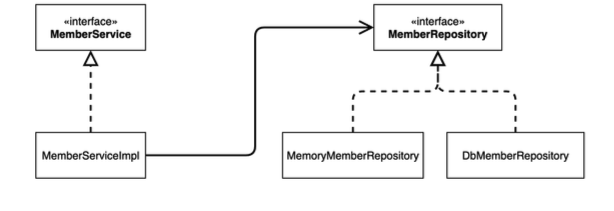

**인프런 강의**
**저자: 김영한**

# 전체 목차

[1. 객체 지향 설계와 스프링](#1-객체-지향-설계와-스프링)
[2. 스프링 핵심 원리 이해1 - 예제 만들기](#2-스프링-핵심-원리-이해1---예제-만들기)
[3. 스프링 핵심 원리 이해2 - 객체 지향 원리 적용](#3-스프링-핵심-원리-이해2---객체-지향-원리-적용)
[4. 스프링 컨테이너와 스프링 빈](#4-스프링-컨테이너와-스프링-빈)
[5. 싱글톤 컨테이너](#5-싱글톤-컨테이너)
[6. 컴포넌트 스캔](#6-컴포넌트-스캔)
[7. 의존관계 자동 주입](#7-의존관계-자동-주입)
[8. 빈 생명주기 콜백](#8-빈-생명주기-콜백)
[9. 빈 스코프](#9-빈-스코프)

# 1. 객체 지향 설계와 스프링

## 좋은 객체 지향 설계의 5가지 원칙 (SOLID)

### SOLID

**클린코드로 유명한 로버트 마틴이 좋은 객체 지향 설계의 5가지 원칙을 정리**

- SRP: 단일 책임 원칙(single responsibility principle)
- OCP: 개방-폐쇄 원칙 (Open/closed principle)
- LSP: 리스코프 치환 원칙 (Liskov substitution principle)
- ISP: 인터페이스 분리 원칙 (Interface segregation principle)
- DIP: 의존관계 역전 원칙 (Dependency inversion principle)

## 스프링

**스프링은 다음 기술로 다형성 + OCP, DIP를 가능하게 지원**

- DI(Dependency Injection): 의존관계, 의존성 주입
- DI 컨테이너 제공
- **클라이언트 코드의 변경 없이 기능 확장**
- 쉽게 부품을 교체하듯이 개발

# 2. 스프링 핵심 원리 이해1 - 예제 만들기

## 비즈니스 요구사항과 설계

- **회원**
  - 회원을 가입하고 조회할 수 있다.
  - 회원은 일반과 VIP 두 가지 등급이 있다.
  - 회원 데이터는 자체 DB를 구축할 수 있고, 외부 시스템과 연동할 수 있다. (미확정)
- **주문과 할인 정책**
  - 회원은 상품을 주문할 수 있다.
  - 회원 등급에 따라 할인 정책을 적용할 수 있다.
  - 할인 정책은 모든 VIP는 1000원을 할인해주는 고정 금액 할인을 적용해달라. (나중에 변경 될 수 있다.)
  - 할인 정책은 변경 가능성이 높다. 회사의 기본 할인 정책을 아직 정하지 못했고, 오픈 직전까지 고민을 미루 고 싶다. 최악의 경우 할인을 적용하지 않을 수 도 있다. (미확정)

## 회원 도메인 설계

- **회원 도메인 요구사항**
  - 회원을 가입하고 조회할 수 있다.
  - 회원은 일반과 VIP 두 가지 등급이 있다.
  - 회원 데이터는 자체 DB를 구축할 수 있고, 외부 시스템과 연동할 수 있다. (미확정)

**회원 도메인 협력 관계**

](studyImg/member.png)

**회원 클래스 다이어그램**

**회원 객체 다이어그램**

](studyImg/member3.png)

## 주문과 할인 도메인 설계

- **주문과 할인 정책**
  - 회원은 상품을 주문할 수 있다.
  - 회원 등급에 따라 할인 정책을 적용할 수 있다.
  - 할인 정책은 모든 VIP는 1000원을 할인해주는 고정 금액 할인을 적용해달라. (나중에 변경 될 수 있다.)
  - 할인 정책은 변경 가능성이 높다. 회사의 기본 할인 정책을 아직 정하지 못했고, 오픈 직전까지 고민을 미루 고 싶다. 최악의 경우 할인을 적용하지 않을 수 도 있다. (미확정)

**주문 도메인 협력, 역할, 책임**

!](studyImg/order.png)

**1. 주문 생성:** 클라이언트는 주문 서비스에 주문 생성을 요청한다.

**2. 회원 조회:** 할인을 위해서는 회원 등급이 필요하다. 그래서 주문 서비스는 회원 저장소에서 회원을 조회한다.

**3. 할인 적용:** 주문 서비스는 회원 등급에 따른 할인 여부를 할인 정책에 위임한다.

**4. 주문 결과 반환:** 주문 서비스는 할인 결과를 포함한 주문 결과를 반환한다.

**주문 도메인 전체**

](studyImg/order1.png)

**역할과 구현을 분리**해서 자유롭게 구현 객체를 조립할 수 있게 설계했다. 덕분에 회원 저장소는 물론이고, 할인 정책도 유연하게 변경할 수 있다.

**주문 도메인 클래스 다이어그램**

](studyImg/order2.png)

**주문 도메인 객체 다이어그램1**

](studyImg/order3.png)

**주문 도메인 객체 다이어그램2**

](studyImg/order4.png)

회원을 메모리에서 조회하고, 정액 할인 정책(고정 금액)을 지원해도 주문 서비스를 변경하지 않아도 된다. 역할들의 협력 관계를 그대로 재사용 할 수 있다.

# 3. 스프링 핵심 원리 이해2 - 객체 지향 원리 적용

# 4. 스프링 컨테이너와 스프링 빈

# 5. 싱글톤 컨테이너

# 6. 컴포넌트 스캔

# 7. 의존관계 자동 주입

# 8. 빈 생명주기 콜백

# 9. 빈 스코프
