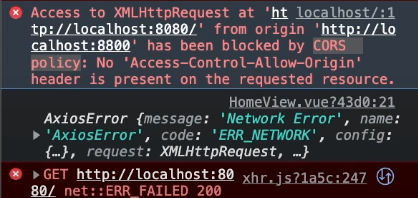

# CORS (Cross-origin Resource Sharing) 오류

**내가 요청한 url**

- vue에서 직접적으로 도메인을 요청했음 
- 찾아본 결과
> 특정 교차 도메인간(cross-domain) 요청,
> 특히 Ajax 요청은 동일- 출처 보안정책에 의해 금지됨 

## 해결방법 1

### front-end proxy 설정하기

**vue.config.js** 

- 내로컬에서는 쓸수 있지만 배포했을때는 사용 불가능

## 해결방법 2
### back-end path설정 

> 특정 교차 도메인간(cross-domain)허용 요청 방법
> - 리소스 서비스 서버에서 특정 교차 도메인(vue3) 등록
> - 요청하는 도메인 서버쪽 proxy 설정으로 우회 접속하기
>
- @CrossOrigin 등록 하기!! 
- JAVA에서 이방법으로 하는게 더 좋은듯