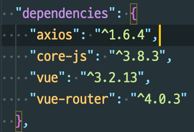

# 프로젝트 구성 설명 


# 목차
- [ERROR해결](ERROR.md)
- [프로젝트 환경설정 파일](INSTALL.md)
- [Vue3 실행](#vue3-실행)
  - [Router SET](#router-set)


# Vue3 실행

**pakage.json**
```bash
"serve": "vue-cli-service serve --port 8800",
```
- backend 8080 서버와 다른 portfmf 사용하기위해 변경

## Router Set


1. 사용자 목록 페이지 
   - ListView.vue "/user"
2. 사용자 등록 페이지 
    - CreateView.vue "/user/save"
3. 사용자 정보 페이지 
    - SelectView.vue "/user/findById"
4. 사용자 정보 수정 페이지 
    - UpdateView.vue "/user/editById"

- HomeView.vue "/"

**router/index.js 에서 설정**

```html
 {
    path: "/user/editById",
    name: "UpdateView",
    component: () =>
      import(/* webpackChunkName: "user" */ "../views/UpdateView.vue"),
  },
  {
    path: "/user/save",
    name: "CreateView",
    component: () =>
      import(/* webpackChunkName: "user" */ "../views/CreateView.vue"),
  },
```
- path : Url 
- name : 파일이름
- component()=>{ 파일경로 }

# axios 사용 

    $ npm install axios

**package.jon** <br>


### frontend 데이터 요청
``` vue

/** methods axios 호출
   *  get방식으로 호출
   *  .then((response )=>{}) -> 요쳥에 성공하였을시
   *  .catch((error)=>{}) -> 에러 발생시 처리
   */
   
  methods: {
    getDate() {
      axios
        .get("http://localhost:8080/")
        .then((res) => {
          console.log(res);
        })
        .catch((error) => {
          console.log(error);
        });
    },
  },
```

# Back-end 데이터 처리하기 

